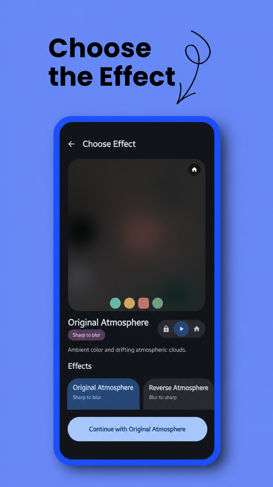
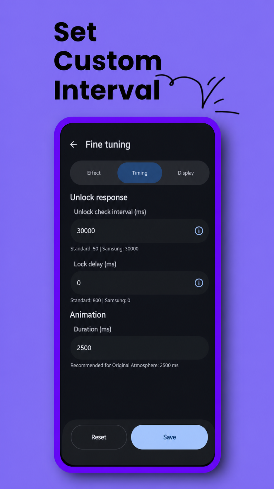
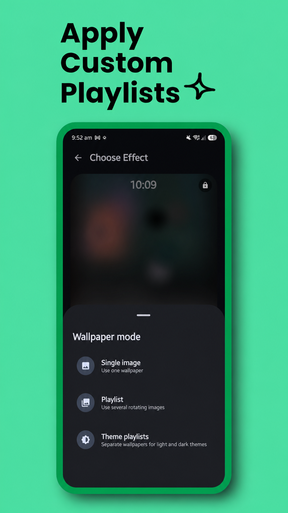
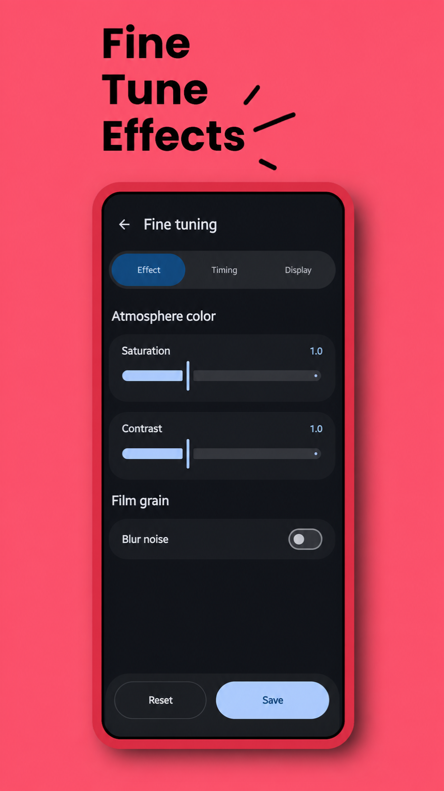

# Atmo Engine

**Atmo Engine** is an open-source Android live wallpaper studio inspired by the distinctive Atmosphere transition in Nothing OS. It adds animated lock-screen-to-home-screen effects, accurate previews, flexible image fitting, and wallpaper playlists without uploading your images.

## 📥 Download
Atmo Engine is available to download from the Play Store, F-Droid and Orion Store.

<a href="https://play.google.com/store/apps/details?id=com.saad_khan_rind.atmosphere_effect">

</a>

<a href="https://f-droid.org/packages/com.saad_khan_rind.atmosphere_effect/">

</a>

## ⚠️ Device Support & Disclaimer

**Current Testing Status:**
This application has currently been tested **exclusively on the Samsung Galaxy S25 Ultra and Nothing Phone 1**.

While it may work on other Android devices running Android 13+ (API 33+), behavior on different manufacturers' skins (FuntouchOS, OxygenOS, etc.) is not guaranteed.

## Usage Guide

Follow these steps to set up the effect properly on your device.

### ⚡ Quick Setup: Share an Image

The fastest way to apply a wallpaper. Instead of opening the app and browsing for a file, you can send an image straight to Atmo Engine from anywhere:

1. Find an image in your **Gallery**, or in any **wallpaper app**.
2. Tap **Share** and choose **Atmo Engine** ("Set with Atmo Engine") from the share sheet.
3. Pick the effect you want — the app takes you straight to the crop screen and applies it.
   You can share a **single image** for a normal wallpaper, or **select multiple images** before sharing to build a rotating playlist. This skips the extra steps of saving the image, opening the app, and digging through your files to find it again. The regular in-app flow below still works exactly the same.

### 1\. Select Your Effect

Open the app and choose your desired atmosphere style from the selection screen:

* **Original Atmosphere:** Signature style. A sharp wallpaper flows into drifting ambient clouds and blur.
* **Reverse Atmosphere:** Mysterious reveal. Deep ambient clouds clear to reveal the wallpaper.
* **Simple Frosted:** Modern minimalism. Applies a clean, uniform frosted glass blur (no clouds).
* **Simple Frosted (Reverse):** Elegant clarity. Wakes up from a heavy frosted blur into a crystal clear wallpaper.
* **Halftone Print:** Retro aesthetic. Sharp view dissolves into comic-book CMYK dots when locked.
* **Halftone Print (Reverse):** Retro aesthetic. CMYK dots seamlessly expand into continuous color when unlocked.
* **Color Fill:** Liquid awakening. Colors flow outward from your fingerprint.
* **Color Fill (Reverse):** Fluid drain. Colors wash away into grayscale.
* **Canvas Sketch:** A soft monochrome sketch transitions into the full wallpaper when unlocked.
* **Canvas Sketch (Reverse):** The full wallpaper transitions back into its monochrome sketch.

#### Canvas Sketch and Subject Segmentation

Canvas Sketch is fully offline. It includes the open-source U2NetP foreground model directly in the app, so there is nothing to download and no Google Play services or ML Kit dependency. For wallpapers with a prominent person, character, animal, or object, subject segmentation can isolate that subject before drawing the sketch:

1. Open **Fine Tuning** for Canvas Sketch.
2. Turn on **Subject Segmentation**.
3. Preview or apply the wallpaper normally.

Segmentation runs locally through the F-Droid-compatible LiteRT runtime. If no confident foreground subject is found, Canvas Sketch automatically falls back to sketching the complete wallpaper. Wallpaper image contents and generated masks never leave the device. Atmo Engine does not request the `INTERNET` or `ACCESS_NETWORK_STATE` permission.

### 2\. Select Image & Playlist Mode
After selecting an effect, you will be prompted to choose your wallpaper mode:

* **Single Image:** Standard mode. Pick one image, crop it, and apply.

* **Multiple Images (Playlist):** Select multiple images from your gallery to create a wallpaper playlist. Apply it directly or adjust and crop each image first. Once finished, Atmo rotates through the collection using your selected interval.

* **Theme Playlists:** Build separate Light and Dark playlists with one or more wallpapers in each. Atmo switches to the matching collection when the system theme changes, then rotates within that collection using your selected interval.

* **Edit Existing Playlist:** If you already have a standard or theme-based playlist running, this option loads your saved wallpapers (including your exact zoom and crop settings). You can remove images, add new ones, or tweak existing crops without starting over.

### 3\. Application & Activation

Please follow these simple steps to apply the wallpaper:

1. **Apply the Wallpaper:** Once you are happy with your crop or playlist selection, tap the **"Apply"** button.
2. **Review Instructions:** A dialog box will appear with instructions to set the wallpaper to both screens. Tap **"Set Wallpaper"** to proceed.
3. **Set Wallpaper:** The app will redirect you to the Android System's Live Wallpaper preview screen. Tap **"Set Wallpaper"** (or the checkmark/apply icon, depending on your device).
4. **MANDATORY Selection:** When prompted, you must select **"Home screen and Lock screen"**.
   > *Why? Both screens must be controlled by the live wallpaper to ensure a smooth transition when you unlock your device.*
5. **Finish:** Setup is complete! Lock and unlock your screen to see the applied effect in action.

## Interface and Previews

Atmo Engine uses Jetpack Compose and Material 3 throughout the setup flow. Material Expressive styling follows the device's system color palette when enabled, while the appearance panel also supports fixed colors, System/Light/Dark modes, and an optional pitch-black dark background.

Effect cards, the active-wallpaper dashboard, crop screens, and playlist cards use live previews driven by the real effect implementations. This lets you inspect the selected wallpaper and transition before applying it through Android's live wallpaper screen.


## Advanced Customization
Take full control of the animation and look. You can now tweak the following settings dynamically:
### Visual Adjustments
* **Dimness Level:** Adjust the darkening overlay to ensure your home screen icons remain readable against bright wallpapers.
* **Blob Saturation:** (Original Atmosphere & Reverse Atmosphere Effects Only) Adjusts the color intensity of the drifting atmospheric clouds. Increase to make the colors vibrant and punchy, or decrease to zero for a muted, grayscale cloud effect.
* **Blob Contrast:** (Original Atmosphere & Reverse Atmosphere Effects Only) Adjusts the harshness of the atmospheric clouds. Higher values create distinct, separated color pools, while lower values blend the colors softly and smoothly together.
* **Blur Strength:** (Frosted Effects Only) Use the slider to fine-tune the intensity of the blur radius, from a light mist to heavy glass.
* **Noise Grain:** Enable a film-grain texture on top of the blur. You can customize:
    * **Noise Strength:** How visible the grain is.
    * **Noise Scale:** The size/coarseness of the grain particles.
* **Halftone Pixel Size:** (Halftone Effects Only) Dynamically adjust the size of the printed dots. Setting this to `0` renders the original continuous tones instead of dots.
* **Black & White Effect:** (Halftone Effects Only) Converts the CMYK color halftone pattern into a single-channel grayscale newspaper print.
* **Fingerprint Location:** (Color Fill Effects Only) Two sliders to adjust the horizontal and vertical position of effect start place sync with the fingerprint location.
* **Sketch Detail:** (Canvas Sketch Only) Controls how many wallpaper contours are retained.
* **Line Thickness:** (Canvas Sketch Only) Adjusts the width of the monochrome sketch lines.
* **Subject Segmentation:** (Canvas Sketch Only) Optionally limits the sketch to a detected foreground subject using the bundled offline U2NetP model.
### Animation & Behavior
* **Animation Duration:** Control the total transition duration.
* **Lock Delay (Anti-Flicker):** Adds a configurable pause before the wallpaper resets when you lock the phone. This prevents the visual glitch where the wallpaper "snaps" back to its initial state before the screen turns fully black.
* **Unlock Check Interval:** Adjusts how frequently the app detects unlock events. Tuning this eliminates "delayed start" issues, ensuring the animation begins immediately when you wake your device.
* **Sync System Colors:** Publishes a locally extracted wallpaper palette to Android whenever a single wallpaper or playlist image changes. Whether the wider system theme refreshes is ultimately controlled by the device manufacturer.
### Playlist & Rotation
(Available when using Playlist or Theme Playlists mode)
* **Rotation Interval:** Controls how often the wallpaper changes from your playlist.
    * **Options:** Every Lock (Instant), 1 Minute, 15 Minutes, 1 Hour, up to 24 Hours.
    * **Theme Playlists:** A system Light/Dark change immediately switches collections. The selected interval continues to control rotation inside whichever collection is active.
    * **Smart Rotation:** To prevent lag or visual glitches, the wallpaper only rotates when the screen is OFF.
    * *Example:* If you set "15 Minutes", the app checks the time whenever you lock your phone. If 15 minutes have passed since the last change, it swaps the wallpaper in the background so it's ready the next time you unlock.

### Palette Diagnostics

When an Atmo wallpaper is active, tap the **Atmo Engine** title seven times to open the device-specific palette diagnostics screen. It compares Atmo's locally extracted colors, Android's Wallpaper API colors, and the current system color resources. The Force Apply test is available only while **Sync System Colors** is enabled. Diagnostic values and engine traces remain on the device.

## Screenshots
<div align="center">
  
  
  <br/>
  
  
  <br/>
</div>

## Telegram Group
I've made a Telegram group for discussing issues and feature suggestions. You can join it using [this link](https://t.me/atmosphereEffect).

## Known Issues

* **Samsung Adaptive Clock:** One UI may disable or limit its adaptive clock treatment while a live wallpaper is active.

## Build & Installation

This project is built using Kotlin and Gradle.

Canvas Sketch subject segmentation uses the Apache-2.0 U2NetP model and the source-built `tensorflow-lite-fdroid` runtime. No proprietary ML Kit or Google Play services dependency is included. Model and runtime provenance is recorded in [THIRD_PARTY_NOTICES.md](THIRD_PARTY_NOTICES.md).

1.  Clone the repository.
2.  Open in the latest stable Android Studio.
3.  Sync Gradle.
4.  Build and Run on your device.

<!-- end list -->

```bash
git clone https://github.com/saad-khan-rind/NOSAtmosphereEffect.git
```

## Author

**Saad Ullah Khan**
📍 Passau, Germany
📧 [khansaad45678900@gmail.com](mailto:khansaad45678900@gmail.com)
🔗 [LinkedIn](https://www.linkedin.com/in/saadullahkhan456)
💻 [GitHub](https://github.com/saad-khan-rind)
📄 [Download Resume](https://drive.google.com/uc?export=download&id=1CyeubsV7WKZeDb6N-XZbwBq42C6JF3Sn)
🌐 [Portfolio](https://portfolio-frontend-lovat-nine.vercel.app)

## License

This project is open-source and available under the [MIT License](LICENSE). Bundled third-party components retain their respective open-source licenses; see [THIRD_PARTY_NOTICES.md](THIRD_PARTY_NOTICES.md).

## Privacy Policy

The privacy policy is [this](https://saad-khan-rind.github.io/NOSAtmosphereEffect/privacy-policy).

---

⭐️ **Feel free to fork, star, and use this code!**

---
